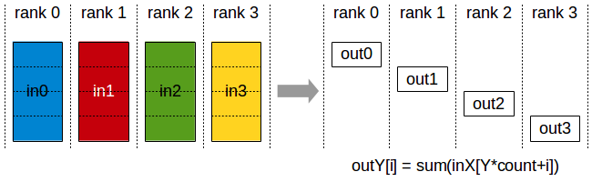
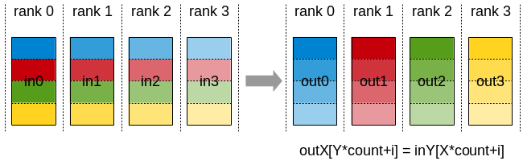

---
title: NCCL 集合通信原语详解
published: 2026-09-10
description: 从 Broadcast 到 AllToAll，图解 NCCL 六大集合通信操作
tags: [NCCL, 分布式训练]
category: 深度学习
draft: false
---

:::warning
本文含 AI 生成内容
:::

NCCL（NVIDIA Collective Communications Library）是 NVIDIA 推出的集合通信库，专为多 GPU 通信优化，是几乎所有分布式训练框架的底层通信引擎——PyTorch DDP、FSDP、Megatron-LM、DeepSpeed 等都通过 NCCL 完成跨卡数据传输。

本文系统介绍 NCCL 的六大集合通信原语，逐个图解语义，并深入拆解最复杂的 AllToAll。

---

# 1. 集合通信基础

在深入学习具体原语之前，先建立几个基本概念。

## Rank 与 World Size

- **Rank**：分布式进程的唯一编号（0, 1, 2, ...）
- **World Size**：参与通信的进程总数
- 每个 rank 只知道自己的编号和 world size，通信原语通过 rank 号来区分收发方

## 集合通信 vs 点对点通信

| 类型 | 描述 | 参与者 |
|------|------|--------|
| 点对点（P2P） | Send/Recv，一个发一个收 | 2 个 rank |
| 集合通信（Collective） | 所有 rank 同时参与 | 全部 rank |

集合通信的**关键约束**：所有 rank 必须调用同一个集合操作，否则程序将死锁。

## NCCL 通信流程

NCCL 默认使用 CUDA stream 驱动，所有通信操作都是异步的：函数调用后立即返回，实际数据传输在 GPU 上执行。同步点由 cudaStreamSynchronize 或后续依赖该数据的 CUDA kernel 触发。

---

# 2. NCCL 六大核心原语一览

以下六大原语覆盖了分布式训练中绝大多数通信场景：

| 原语 | NCCL C API | 数据流向 | 特点 |
|------|-----------|----------|------|
| Broadcast | ncclBroadcast | 1 → All | 全员拿同一份数据 |
| Reduce | ncclReduce | All → 1 | 结果归约到 root |
| AllReduce | ncclAllReduce | All → All | 全员拿归约结果 |
| AllGather | ncclAllGather | All → All | 全员拿所有人的拼接（完整副本） |
| ReduceScatter | ncclReduceScatter | All → All | 全员拿归约结果的切片 |
| AllToAll | ncclAllToAll (2.18+) | All → All | 发给每家的数据都不同 |

> 此外 NCCL 还提供了 Gather（多对一收集）和 Scatter（一对多分发）原语，但实践中使用频率相对较低。

---

# 3. 逐原理解析

## 3.1 Broadcast — 一对多广播

```c
ncclBroadcast(sendbuff, recvbuff, count, datatype, root, comm, stream);
```

**语义**：root rank 的 sendbuff 中的 N 个值被复制到所有 rank 的 recvbuff 中。非 root rank 的 sendbuff 被忽略。

**典型应用**：模型参数初始化广播、配置文件分发。


---

## 3.2 Reduce — 多对一归约

```c
ncclReduce(sendbuff, recvbuff, count, datatype, op, root, comm, stream);
```

**语义**：所有 rank 的 sendbuff 经过归约操作（如求和 ncclSum、求最大值 ncclMax），结果只保存到 root rank 的 recvbuff 中。非 root rank 的 recvbuff 未定义。

**常用归约操作**：ncclSum、ncclProd、ncclMax、ncclMin、ncclAvg。


---

## 3.3 AllReduce — 全规约（最常用）

```c
ncclAllReduce(sendbuff, recvbuff, count, datatype, op, comm, stream);
```

**语义**：所有 rank 的 sendbuff 经过归约后，每个 rank 都拿到完整的归约结果。这是 Reduce + Broadcast 的组合效果。

**典型应用**：数据并行训练中的梯度同步——每个 GPU 算出本地梯度后，调用 AllReduce 让所有 GPU 获得平均梯度。


AllReduce 是分布式训练中使用频率最高的集合操作，其底层通常通过 Ring 算法实现（详见第 4 节）。

---

## 3.4 AllGather — 全收集

```c
ncclAllGather(sendbuff, recvbuff, sendcount, datatype, comm, stream);
```

**语义**：每个 rank 发送 N 个值，所有 rank 接收 world_size × N 个值，按 rank 顺序拼接。rank 0 的数据占据前 N 个位置，rank 1 的数据占据接下来的 N 个位置，以此类推。

**典型应用**：序列并行中获取完整的序列/注意力头数据；全量参数收集。


AllGather 之后，每个 rank 都有完整副本——这是它与 AllToAll 最本质的区别。

---

## 3.5 ReduceScatter — 规约分散

```c
ncclReduceScatter(sendbuff, recvbuff, recvcount, datatype, op, comm, stream);
```

**语义**：每个 rank 发送 world_size × N 个值，先对 rank 间对应位置做归约，然后将归约结果均匀切分，每个 rank 只拿到其中一份（N 个值）。

**典型应用**：在张量/序列并行中作为 AllReduce 的前半段（Ring AllReduce 的第一阶段）。



ReduceScatter 扮演着 Reduce + Scatter 的角色——先归约所有人的数据，再把结果按 rank 散开。

---

## 3.6 AllToAll — 全交换

```c
ncclAllToAll(sendbuff, recvbuff, sendcount, datatype, comm, stream);
```

**语义**：每个 rank 给每个 rank（包括自己）发送不同数据，同时从每个 rank 接收不同数据。

**NCCL 支持情况**：ncclAllToAll 从 NCCL 2.18 开始加入。

**典型应用**：MoE（混合专家）模型的 dispatch/combine、序列并行中切换切分维度。



AllToAll 是六个原语中最复杂的——下一节将用分块矩阵转置视角深度拆解。

---

# 4. 原语之间的关系

这些原语并非彼此独立，它们之间存在优雅的组合关系。

## Reduce + Broadcast = AllReduce

如果 NCCL 不提供 AllReduce，你可以先调 Reduce 让 root 拿到规约结果，再调 Broadcast 分发给全员。但 NCCL 对 AllReduce 做了深度优化（Ring 算法），这种组合的性能远不如原生 AllReduce。

## ReduceScatter + AllGather = AllReduce（Ring 算法）

这是 Ring AllReduce 的两阶段实现，也是现代 GPU 集群上 AllReduce 的标准实现路径：

```
阶段一：ReduceScatter
    每个 rank 把数据切成 W 块
    rank i 对第 i 块做归约，拿到该块的归约结果
    → 每个 rank 持有 1/W 的完整归约结果

阶段二：AllGather
    rank i 把自己持有的那块归约结果广播给所有 rank
    → 每个 rank 拼出完整的归约结果
```

**收益**：通信量从 O(W) 降低到 O(2(W-1)/W × 数据量)，且带宽利用率随 world size 增大而提高。

---

## AllGather vs AllToAll

两者都是 all → all，但结果截然不同：

```
AllGather 之后：每个 rank 持有所有人的数据（完整副本）
AllToAll  之后：每个 rank 只持有属于自己的那一列（数据被转置了）

用矩阵视角（4 rank 等分）：
       发送\\接收   rank0 rank1 rank2 rank3
rank0  [  A00    A01    A02    A03  ]
rank1  [  A10    A11    A12    A13  ]
rank2  [  A20    A21    A22    A23  ]
rank3  [  A30    A31    A32    A33  ]

AllGather: rank i 的输出 = 整张矩阵（全部 4×4 = 16 块）
AllToAll:  rank i 的输出 = 第 i 列 = [A0i, A1i, A2i, A3i]（4 块）
```

**数据总量守恒，但重组方式不同**。AllGather 是复制扩散，AllToAll 是打散重组。

---

# 5. 深入 AllToAll

AllToAll 是六大原语中最绕的一个，下面以 PyTorch 的 all_to_all_single 为入口，彻底拆解其语义。

## 5.1 为什么需要 AllToAll

假设 4 个 rank 各持有一批数据，但数据的目的端是乱的：

```
rank 0: [D0, D3, D0, D1]     ← 每条数据要去往不同 rank
rank 1: [D2, D0, D3, D0]
rank 2: [D1, D2, D2, D0]
rank 3: [D3, D1, D1, D2]
```

你需要把数据按目的 rank 重排——rank 0 给每个 rank 发一部分数据，同时从每个 rank 收一部分。

已有原语都解决不了这个问题：

| 原语 | 为什么不适用 |
|------|-------------|
| broadcast | 只能发同一份 |
| all_reduce | 只能求和/聚合，不能重新分发 |
| all_gather | 拿到的数据太多（所有人完整副本） |
| reduce_scatter | 先归约再分发，无法保留原始数据 |

于是需要一种新模式：**每个 rank 都给每个 rank（包括自己）发一段数据，且发给各家的数据各不相同**——这就是 AllToAll。

## 5.2 PyTorch API 拆解

```python
torch.distributed.all_to_all_single(
    output,                    # [out] 本 rank 的输出张量
    input,                     # [in]  本 rank 的输入张量
    output_split_sizes=None,   # List[int]: 我从每个 rank 收多大
    input_split_sizes=None,    # List[int]: 我发给每个 rank 多大
    group=None,
)
```

每个 rank 只看得到自己的输入输出；全局语义由所有 rank 的参数共同决定。

### input 与 input_split_sizes

input 沿第 0 维按 input_split_sizes 切成 world_size 段：

```
input  = [ chunk_0 | chunk_1 | ... | chunk_{W-1} ]
chunk_j 发给 rank j
```

input.shape[0] 必须等于 sum(input_split_sizes)。

### output 与 output_split_sizes

output 同样按 output_split_sizes 分段：

```
output = [ slot_0 | slot_1 | ... | slot_{W-1} ]
slot_j ← 来自 rank j 的数据
```

output.shape[0] 必须等于 sum(output_split_sizes)。

### 两个 split_sizes 都是本 rank 视角

这是最容易搞混的地方：

- input_split_sizes（本 rank）：我发给 rank 0/1/2/… 各多少
- output_split_sizes（本 rank）：我从 rank 0/1/2/… 各收多少

**一致性约束**：rank i 的 input_split_sizes[j] 必须等于 rank j 的 output_split_sizes[i]——我发给你的，必须和你要收的一致。

```
rank i 的 input_split_sizes[j]  ==  rank j 的 output_split_sizes[i]
        └──────── 这两个数描述同一块数据 ────────┘
```

### 均分时可以偷懒

两个 split 都传 None 时，默认均匀切分：要求 input.shape[0] 能被 world_size 整除，每份 input.shape[0] // W。这是最常用的形态。

### 与 all_to_all 的区别

PyTorch 提供两种 all-to-all：

| | all_to_all_single | all_to_all |
| --- | --- | --- |
| 输入形态 | 一个大 tensor | tensor list（发往各 rank 的 list） |
| 输出形态 | 一个大 tensor | tensor list（来自各 rank 的 list） |
| 变长支持 | 通过 split_sizes | 各 rank 的 list 长度可不同 |
| 额外开销 | 无 | list 构建与拆分 |

all_to_all_single 省掉了 Python list 的构建开销，是高性能实现的首选。

## 5.3 分块矩阵转置视角

这是理解 AllToAll 语义的最佳视角。

用 W×W 分块矩阵表示通信：

```
        发送\\接收   rank0   rank1   rank2   rank3
rank0       [  A00     A01     A02     A03  ]   ← rank0 把本地数据切成 W 段
rank1       [  A10     A11     A12     A13  ]
rank2       [  A20     A21     A22     A23  ]
rank3       [  A30     A31     A32     A33  ]
```

- **行 i** = rank i 发出的所有数据（分给各家的 chunk）
- **列 j** = rank j 收到的所有数据（来自各家的 slot）

AllToAll 的语义：

> **rank i 发出的是第 i 行，拿到的是第 i 列——这就是一次跨 rank 的分块矩阵转置。**

```
通信前：数据按发送方排列（行主序）
通信后：数据按接收方排列（列主序）

写代码时按行填表，验证结果时按列读出。
```

这个视角的价值在于：调试时用转置对称性自查——把每个 rank 的 input_split_sizes 拼成矩阵，其转置必须等于所有 rank 的 output_split_sizes 拼成的矩阵。

## 5.4 最小可运行示例

下面是用 PyTorch all_to_all_single 在 3 个 rank 上的完整示例。

### 等分切分（split_sizes=None）

```python
# a2a_demo.py
import os
import torch
import torch.distributed as dist
import torch.multiprocessing as mp

WORLD_SIZE = 3

def run(rank, world_size):
    os.environ["MASTER_ADDR"] = "127.0.0.1"
    os.environ["MASTER_PORT"] = "29501"
    dist.init_process_group("gloo", rank=rank, world_size=world_size)

    inp = torch.arange(rank * 6, (rank + 1) * 6, dtype=torch.float32)
    out = torch.empty(6, dtype=torch.float32)
    dist.all_to_all_single(out, inp)
    print(f"rank {rank}: input={inp.tolist()} output={out.tolist()}")
    dist.destroy_process_group()

if __name__ == "__main__":
    mp.spawn(run, args=(WORLD_SIZE,), nprocs=WORLD_SIZE, join=True)
```

运行 python a2a_demo.py，输出：

```
rank 0: input=[0.0, 1.0, 2.0, 3.0, 4.0, 5.0]  output=[0.0, 1.0, 6.0, 7.0, 12.0, 13.0]
rank 1: input=[6.0, 7.0, 8.0, 9.0, 10.0, 11.0] output=[2.0, 3.0, 8.0, 9.0, 14.0, 15.0]
rank 2: input=[12.0, 13.0, 14.0, 15.0, 16.0, 17.0] output=[4.0, 5.0, 10.0, 11.0, 16.0, 17.0]
```

用转置视角验证：

```
发送\\接收   rank0    rank1    rank2
rank0     [0,1]    [2,3]    [4,5]
rank1     [6,7]    [8,9]    [10,11]
rank2     [12,13]  [14,15]  [16,17]

结果：
  rank 0 输出 = 第 0 列 = [0,1, 6,7, 12,13] OK
  rank 1 输出 = 第 1 列 = [2,3, 8,9, 14,15] OK
  rank 2 输出 = 第 2 列 = [4,5, 10,11, 16,17] OK
```

### 变长切分

当每份数据大小不等时，必须显式传入 split_sizes：

```python
# a2a_variable.py
import os
import torch
import torch.distributed as dist
import torch.multiprocessing as mp

WORLD_SIZE = 3

def run(rank, world_size):
    os.environ["MASTER_ADDR"] = "127.0.0.1"
    os.environ["MASTER_PORT"] = "29501"
    dist.init_process_group("gloo", rank=rank, world_size=world_size)

    send_sizes = [3, 2, 1] if rank == 0 else ([1, 3, 2] if rank == 1 else [2, 1, 3])
    total_send = sum(send_sizes)
    recv_sizes = {0: [3, 1, 2], 1: [2, 3, 1], 2: [1, 2, 3]}[rank]
    total_recv = sum(recv_sizes)

    base = rank * 6
    inp = torch.tensor([float(base + i) for i in range(total_send)], dtype=torch.float32)
    out = torch.empty(total_recv, dtype=torch.float32)
    dist.all_to_all_single(out, inp, output_split_sizes=recv_sizes, input_split_sizes=send_sizes)
    print(f"rank {rank}: send={send_sizes} recv={recv_sizes} output={out.tolist()}")
    dist.destroy_process_group()

if __name__ == "__main__":
    mp.spawn(run, args=(WORLD_SIZE,), nprocs=WORLD_SIZE, join=True)
```

运行 python a2a_variable.py，输出：

```
rank 0: send=[3, 2, 1] recv=[3, 1, 2] output=[0.0, 1.0, 2.0, 100.0, 200.0, 201.0]
rank 1: send=[1, 3, 2] recv=[2, 3, 1] output=[3.0, 4.0, 101.0, 102.0, 103.0, 202.0]
rank 2: send=[2, 1, 3] recv=[1, 2, 3] output=[5.0, 104.0, 105.0, 203.0, 204.0, 205.0]
```

用转置视角核对 rank 2 的输出：第 2 列 = [A02; A12; A22]

- A02 = rank 0 输入的末 1 个 = [5]
- A12 = rank 1 输入的末 2 个 = [104, 105]
- A22 = rank 2 输入的末 3 个 = [203, 204, 205]

拼接 = [5, 104, 105, 203, 204, 205]，与实际输出一致。OK

---

# 6. NCCL 原语在分布式训练中的应用

不同的并行策略依赖不同的集合原语：

| 并行策略 | 主要原语 | 用途 |
|----------|---------|------|
| 数据并行（DDP） | AllReduce | 梯度同步 |
| 数据并行（FSDP） | AllGather + ReduceScatter | 参数分片：前向全收集，反向规约分散 |
| 张量并行（Megatron-LM） | AllReduce | fwd/bwd 中的通信 |
| 序列并行 | AllGather + ReduceScatter | 在序列维和 head 维之间切换 |
| 专家并行（MoE） | AllToAll | dispatch/combine 阶段 |
| 流水并行 | P2P（Send/Recv） | 非集合通信 |

---

# 7. 总结

| 原语 | NCCL API | 本质语义 | 输出大小 |
|------|---------|---------|---------|
| Broadcast | ncclBroadcast | root → 全员 | N |
| Reduce | ncclReduce | 全员 → root | N（仅 root） |
| AllReduce | ncclAllReduce | 全员 → 全员（归约） | N |
| AllGather | ncclAllGather | 全员 → 全员（拼接） | W×N |
| ReduceScatter | ncclReduceScatter | 全员 → 全员（归约+散开） | N |
| AllToAll | ncclAllToAll | 全员 → 全员（转置交换） | W×N（但每人只拿一列） |

**AllToAll 一句话总结**：一次跨 rank 的分块矩阵转置——写代码时按行填表，验证结果时按列读出。

> 参考：NVIDIA NCCL 官方文档 — [Collective Operations](https://docs.nvidia.com/deeplearning/nccl/user-guide/docs/usage/collectives.html)
