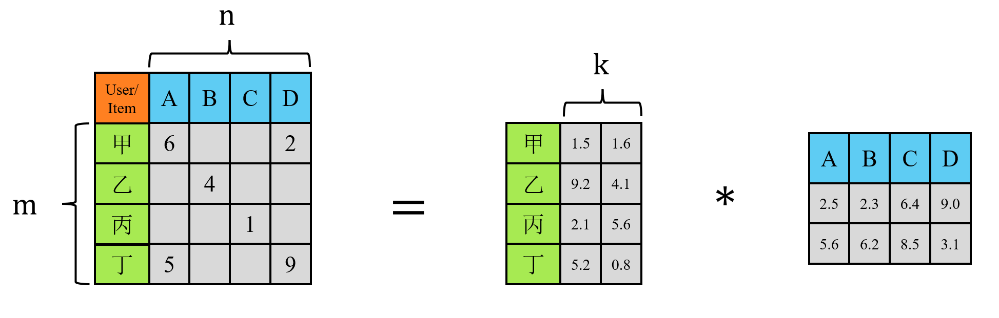

:::warning
本文含 AI 生成内容
:::

## 背景

影视、电商等平台收集的数据可以构造出用户对物品评分的矩阵，例如：

```
          Movie1 Movie2 Movie3 Movie4 Movie5

User1        5      4      ?      2      ?

User2        5      5      4      1      2

User3        1      ?      5      5      4

User4        ?      2      5      5      5
```

行对应用户，列对应物品，元素值是评分。

推荐系统的目标是根据已有数据预测 ？的数值，即 User1 会对 Movie3 和 Movie 5 打多少分。

## 传统协同过滤

传统协同过滤（CF，Collaborative Filtering）分为两种，基于用户的协同过滤（UserCF）和基于物品的协同过滤（ItemCF），下面以 UserCF 举例。

```
           A  B  C  D

Alice      5  4  ?  2

Bob        5  5  4  1

Tom        1  2  5  5
```

UserCF 的思想是找到和当前用户最像的人。

我们想知道 Alice 对 C 的评分，首先寻找和 Alice 最像的人。去除 ? 所在的列，得到各个用户向量：

```
Alice:  [5, 4, 2]
Bob:	[5, 5, 1]
Tom:	[1, 2, 5]
```

根据两两向量之间的余弦相似度可知，Alice 和 Bob 最像。

因为 Bob 喜欢 C，所以系统把 C 也推荐给 Alice（具体的预测值计算方法不赘述）。 

ItemCF 的思想则是寻找相似的物品。在工业界，ItemCF 应用远比 UserCF 广泛，原因是用户的状态每天都在变化，而物品之间的关系相对稳定。

一张图概括协同过滤：

```
                协同过滤
                   │
        ┌──────────┴──────────┐
        │                     │
     UserCF                ItemCF
   （找相似用户）         （找相似物品）
        │                     │
Alice ← Bob             iPhone ← AirPods
        │                     │
Bob喜欢C              买iPhone的人常买AirPods
        │                     │
推荐Movie C           推荐AirPods
```


## 矩阵分解

基于矩阵分解（MF，Matrix Factorization）的协同过滤不再直接比较"用户和用户"或者"物品和物品"，而是学习用户和物品的隐藏特征（Latent Factor）。DLRM 的 Embedding 思想可以追溯到这。

现实中评分矩阵是一张巨大的稀疏的表，寻找相似用户或相似物品往往很困难：

```
            IronMan  Batman  Titanic  Frozen  Avengers

Alice          5        4        ?        ?        5

Bob            5        5        ?        ?        4

Tom            ?        ?        5        4        ?

Lucy           ?        ?        4        5        ?
```

可以看到，Alice 和 Tom 没有共同评分，无法计算相似度；Alice 和 Bob 有共同评分，但 Bob 没有对 Titanic 和 Frozen 的评分，传统 CF 无法评估 Alice 对这俩的兴趣程度。

一个新的想法是用隐向量表征用户和电影的潜在属性，把用户和电影映射到低维连续空间，用户对电影的评分表示为两个隐向量的内积。于是乎，稀疏高维矩阵近似拆解为两个低秩密集矩阵的乘积。一般地，$k << m, n$ 。



隐向量具体长什么样，就要通过解析法或者深度学习知晓。训练好的隐向量可以很好地代表用户或物品，但它潜在的真实含义就不得而知了。

Embedding Table 实际上就是矩阵分解中用户矩阵和物品矩阵的推广：

- **矩阵分解**：一个用户只有一个向量，一个物品只有一个向量。
- **现代推荐模型**：每个离散特征（用户 ID、商品 ID、类别、品牌、城市等）都有自己的 Embedding Table，再通过特征交互（如点积、MLP、Cross Network 等）学习更复杂的关系。