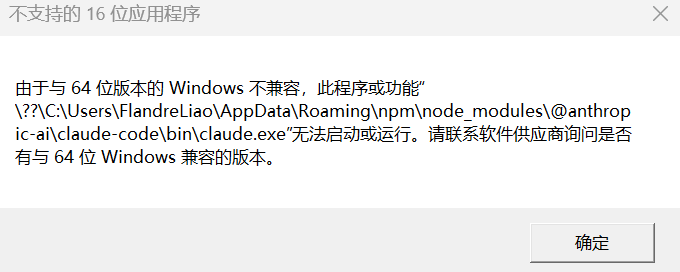

:::warning
本文含 AI 生成内容
:::

# 问题

今天更新 claude code 遇到如图错误：

```
claude update
```

即使我 `npm uninstall` 之后再执行 `npm install -g @anthropic-ai/claude-code` ，依然出现同样的错误。



原因是 Claude Code 自 2.1.113 从 npm 分发迁移到 Native Binary 后，npm 包的行为发生了变化。如果旧 npm 安装环境没有正确执行新版安装脚本，就可能留下一个错误的 `claude.exe`，于是 Windows 报“16位应用程序”。

卸载 Claude code 后使用官方推荐命令重新安装：

```
irm https://claude.ai/install.ps1 | iex
```

或者

```
winget install Anthropic.ClaudeCode
```

以上两条命令皆以网络访问错误而中止。尝试在浏览器输入地址手动下载 claude.exe 或安装脚本，也失败了，A➗拒绝了我的访问。

# 不优雅的解决方法

最后找到一种曲线救国的方法。先安装分发迁移到 Native Binary 之前的最后一个版本，2.1.112：

```
npm install -g @anthropic-ai/claude-code@2.1.112
```

进入 claude，让它帮忙安装最新版本：

```
> 帮我更新 Claude code 到最新版本

  Thought for 7s (ctrl+o to expand)

● Bash(npm list -g @anthropic-ai/claude-code 2>/dev/null || npm list -g claude-code 2>/dev/null || where claude 2>/dev/null)
  ⎿  C:\Users\FlandreLiao\AppData\Roaming\npm
     `-- @anthropic-ai/claude-code@2.1.112

  Thought for 2s (ctrl+o to expand)

● 当前版本是 2.1.112，我来帮你更新到最新版。

● Bash(npm update -g @anthropic-ai/claude-code)
  ⎿  added 1 package, removed 1 package, and changed 1 package in 6s

     62 packages are looking for funding
     … +6 lines (ctrl+o to expand)

  Thought for 2s (ctrl+o to expand)

● npm 提示 install scripts 被阻止了，需要允许脚本来完成安装。

● Bash(npm install -g --allow-scripts=@anthropic-ai/claude-code @anthropic-ai/claude-code)
  ⎿  changed 2 packages in 2s

  Thought for 1s (ctrl+o to expand)

● Bash(npm list -g @anthropic-ai/claude-code)
  ⎿  C:\Users\FlandreLiao\AppData\Roaming\npm
     `-- @anthropic-ai/claude-code@2.1.215

  Thought for 1s (ctrl+o to expand)

● 已更新完成。Claude Code 从 2.1.112 → 2.1.215，更新了 100+ 个版本。重启 Claude Code 即可使用最新版本。
```

大功告成。

# G 老师的讲解

## Claude Code 的安装方式发生了什么变化？

以前：

```
npm install -g @anthropic-ai/claude-code
```

安装的是一个 Node CLI：

```
@anthropic-ai/claude-code
│
├── cli.js
├── package.json
└── bin/
    └── claude
```

运行：

```
claude
 |
 node
 |
 cli.js
```

本质是 JavaScript 程序。

------

后来 Anthropic 改成 Native：

```
claude.exe
```

也就是：

```
claude
 |
 claude.exe
```

不再依赖 Node。

优势：

- 启动更快
- 不需要 Node
- 更容易跨平台发布
- 可以自己管理更新

所以现在官方推荐：

```
Native Installer
    ↓
claude.exe
```

而不是 npm。

------

## 那 npm 包现在是什么？

关键点：

> npm 包没有简单消失，而是变成了一个“安装器包装”。

现在：

```
npm install @anthropic-ai/claude-code
```

下载：

```
@anthropic-ai/claude-code
        |
        |
        ↓
install.cjs
        |
        |
        ↓
下载/安装 native claude.exe
```

类似：

```
npm package
     |
     |
     +---- install.cjs
              |
              |
              +---- 下载 Windows binary
```

所以 npm 包现在只是一个入口。官方停止把 npm 作为推荐安装入口，并将 Claude Code 主体迁移到 Native Binary；**但 npm 包仍然存在，用于兼容和安装 Native Binary**。

## install.cjs 没执行

新版 npm 安装流程：

```
npm install
 |
 |
 package下载成功
 |
 |
 postinstall
 |
 |
 install.cjs
 |
 |
 下载binary
```

但是你的日志：

```
npm warn install-scripts
package had install scripts blocked
```

说明：

```
postinstall
```

被 npm 拦截。

结果：

```
npm package存在

但是

claude.exe没有正确生成
```

# 真正有效的优雅解决方法

观察之前 claude code 更新自己的命令，它能成功安装的关键之处在于 `--allow-scripts` 。

为了让 `install.cjs` 顺利执行，避免 exe 损坏，我们只需要把

```
npm install -g @anthropic-ai/claude-code
```

替换为

```
npm install -g --allow-scripts=@anthropic-ai/claude-code @anthropic-ai/claude-code
```

# 感想

安装错误、网络错误真是让我抓狂了，好累。