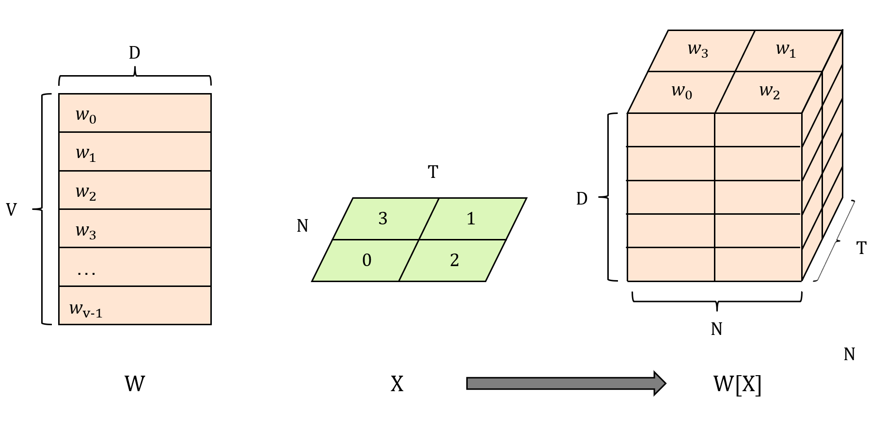

以 RNN 实现中索引 embedding 的场景为例，介绍 Pytorch 以二维整数张量作为索引的 `Array Indexing` 。

$W$ 是 $(V, D)$ 的张量，含有 $V$ 个长度为 $D$ 的 embedding。$X$ 是 $(N, T)$ 的**整数**张量，含有 $N$ 个长度为 $T$ 的序列，每个元素 $idx$ 用于索引 $W$ 的第 $idx$ 行，$idx < V$ 。

当我们用 $X$ 去索引 $W$ ，即 $W[X]$ ，Pytorch 把它理解为：对于 $X$ 的每个元素 $idx$ ，取出 $W$ 的第 $idx$ 行，所有行向量堆叠成一个新的张量，这个张量的形状与 $X$ 极其相似，区别仅在于多了一个 $D$ 维度。

结果张量的形状是 $(N, T, D)$ 。

```
  W = [[w₀],     X = [[3, 1],
       [w₁],          [0, 2]]
       [w₂],
       [w₃]]           → W[X] shape = (2, 2, D)
```

